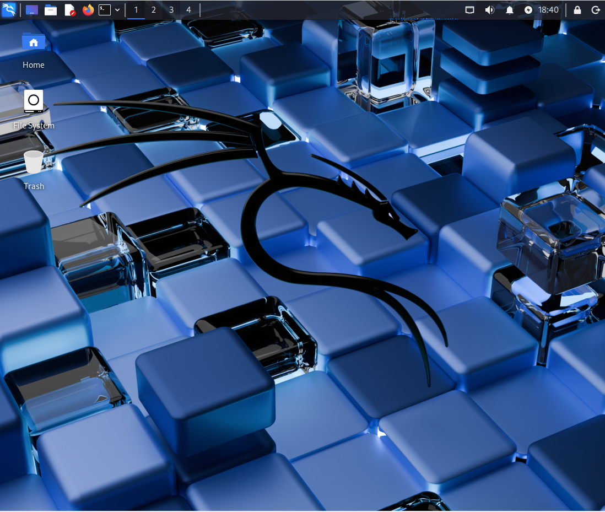
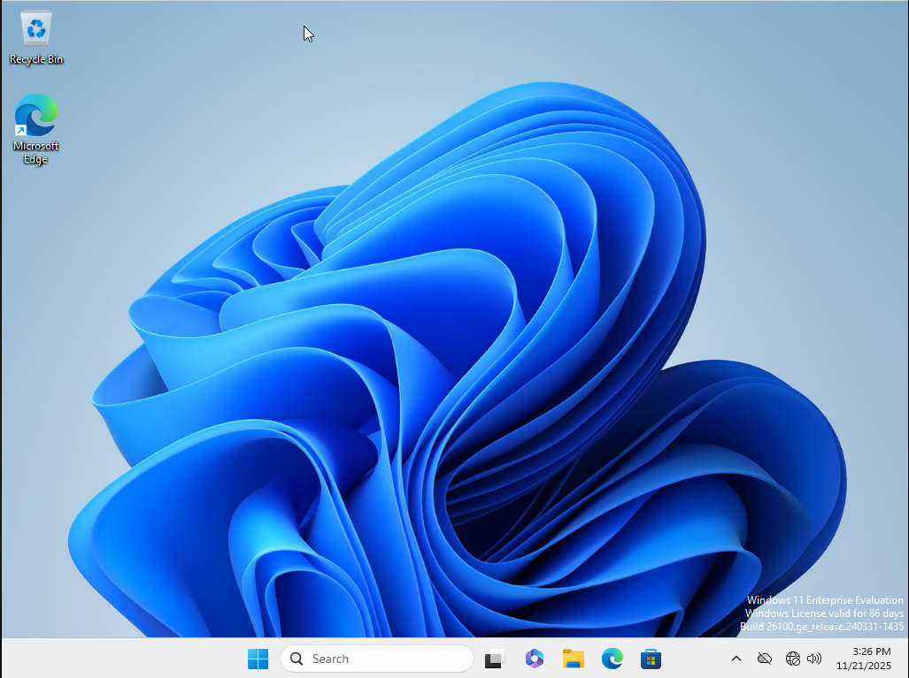

# Phase 1 - Lab Infrastructure Setup

## Overview
This document details the virtualized cybersecurity lab environment built for Phase 1 Purple Team operations. The lab consists of three VMs running on VirtualBox: an attacker machine (Kali Linux), a target system (Windows 11), and a defender/SIEM platform (Ubuntu Server with Splunk Enterprise). 

The environment is isolated using a Host-Only network for safe attack simulation and detection engineering practice. All systems are configured with static IPs for predictable networking, and log forwarding is established between the Windows target and Splunk SIEM for real-time detection capability.

This lab serves as the foundation for credential attack simulations, lateral movement detection, and data exfiltration analysis documented in subsequent case studies.

## Network Architecture

The lab utilizes a VirtualBox Host-Only network (192.168.X.0/24) to create an isolated environment for safe attack simulation. This network segmentation ensures that attack traffic and malicious activity remain contained within the lab and cannot affect external systems or the host machine's home network.

The Kali Linux attacker and Ubuntu-Splunk defender VMs are configured with dual network adapters: Adapter 1 (Host-Only) for isolated lab communication, and Adapter 2 (NAT) for internet access to download tools and updates. The Windows 11 target uses only the Host-Only adapter, maintaining complete isolation with no external connectivity to simulate a realistic enterprise endpoint.

All VMs use static IP addressing for predictable network behavior and simplified configuration management. The VirtualBox Host-Only gateway (192.168.X.1) provides routing within the lab network, while log forwarding between Windows and Splunk occurs over TCP port 9997.

## Virtual Machine Specifications

### Kali Linux (Attacker)
- **Purpose:** Offensive security platform for simulating adversary tactics, techniques, and procedures (TTPs). Used to execute credential attacks, lateral movement, reconnaissance, and data exfiltration scenarios against the Windows 11 target system.
- **OS:** Kali Linux 2025.3 (pre-built VirtualBox image)
- **RAM:** 2 GB
- **CPU:** 2 cores
- **Disk:** 80 GB (virtual), ~28 GB used
- **Network:** 
  - Adapter 1: Host-Only (192.168.X.101) - Lab communication
  - Adapter 2: NAT - Internet access for tool updates
- **Key Tools:** nmap, hydra, CrackMapExec, Impacket, Metasploit, Wireshark

### Windows 11 Enterprise (Target)
- **Purpose:** Simulated enterprise endpoint serving as the attack target. Generates security event logs for detection engineering and validates Purple Team attack scenarios. Represents a typical corporate workstation in a production environment.
- **OS:** Windows 11 Enterprise Evaluation
- **RAM:** 6 GB
- **CPU:** 2 cores
- **Disk:** 50 GB (virtual), ~17 GB used
- **Network:** 
  - Adapter 1: Host-Only (192.168.X.102) - Isolated from internet
- **Configuration:** 
  - RDP enabled for remote access attacks
  - Test users created (testuser1, testuser2, admin1)
  - Splunk Universal Forwarder installed (forwarding to 192.168.X.103:9997)
  - Windows Defender disabled (lab environment only)
  - Windows Security Event Logs monitored (EventID 4624, 4625, 4768, 4769, 4776)
 
  ### Ubuntu Server (Defender/SIEM)
- **Purpose:** Central security monitoring and analysis platform. Aggregates logs from Windows target, performs correlation and detection rule execution, and provides intrusion detection capabilities. Serves as the defensive component of the Purple Team lab environment.
- **OS:** Ubuntu Server 22.04 LTS
- **RAM:** 4 GB
- **CPU:** 2 cores
- **Disk:** 40 GB (virtual), ~6 GB used
- **Network:** 
  - Adapter 1: Host-Only (192.168.X.103) - Lab communication and log reception
  - Adapter 2: NAT - Internet access for updates and tool downloads
- **Services:** 
  - Splunk Enterprise Free (web interface: port 8000, receiving: port 9997)
  - Suricata IDS (interface monitoring)
  - OpenSSH Server (remote management)
  - Wireshark/tshark (packet capture and analysis)
 
  ## IP Address Summary

| System | IP Address | Network Adapter | Role |
|--------|------------|-----------------|------|
| VirtualBox Gateway | 192.168.X.1 | Host-Only Network | Virtual gateway for lab network |
| Kali Linux | 192.168.X.101 | Adapter 1 (Host-Only) | Attacker machine |
| Kali Linux | 10.0.3.X | Adapter 2 (NAT) | Internet access for updates |
| Windows 11 | 192.168.X.102 | Adapter 1 (Host-Only) | Target system (isolated) |
| Ubuntu-Splunk | 192.168.X.103 | Adapter 1 (Host-Only) | SIEM/IDS platform |
| Ubuntu-Splunk | 10.0.3.X | Adapter 2 (NAT) | Internet access for updates |

**Network Details:**
- **Lab Network:** 192.168.X.0/24 (Host-Only, isolated)
- **NAT Network:** 10.0.3.0/24 (VirtualBox default, internet access)
- **Subnet Mask:** 255.255.255.0 (/24)

## Lab Environment Screenshots

### Kali Linux (Attacker)

*Kali Linux VM operational and ready for offensive security operations.*

### Windows 11 (Target)

*Windows 11 Enterprise target system with Splunk Universal Forwarder configured.*

### Ubuntu-Splunk (Defender/SIEM)

*Ubuntu Server running Splunk Enterprise and Suricata IDS.*

**Note:** Due to hardware constraints (16GB RAM), VMs are powered on individually for screenshots. All systems have been verified operational and can communicate on the 192.168.X.0/24 Host-Only network.

## Setup Notes

### Hardware Preparation
This lab environment was built on a Dell OptiPlex 3040 (i5, 16GB RAM) acquired from eBay as a dedicated cybersecurity lab machine. The system arrived with hard drive issues preventing OS boot. After cleaning the case interior and components, the hard drive was reformatted and Ubuntu Desktop was installed as the host operating system, resolving the boot issues and providing a stable foundation for the lab.

### Resource Optimization
With 16GB total RAM, resource management was critical for running multiple VMs simultaneously. The lab was designed to operate efficiently within these constraints by:
- Using lightweight Ubuntu Server (instead of Desktop) for the SIEM/IDS platform
- Allocating RAM conservatively (2-6GB per VM based on role requirements)
- Leveraging VirtualBox snapshots for rapid restoration instead of maintaining multiple VM copies
- Utilizing free and open-source tools (Splunk Free, Suricata, OpenPLC) and evaluation licenses (Windows 11 Enterprise 90-day)
- Starting/stopping VMs as needed rather than running all simultaneously during non-lab periods

### Network Configuration Lessons
Initial network configuration required understanding VirtualBox's network adapter types:
- **Host-Only networks** provide complete isolation for safe attack simulation, preventing any traffic from reaching external networks
- **NAT adapters** enable internet access for updates and tool downloads without exposing VMs to the external network
- **Static IP addressing** was essential for predictable behavior, especially for SIEM log forwarding configuration

Key lesson: Ubuntu Server's Netplan configuration (`.yaml` files in `/etc/netplan/`) requires proper YAML syntax and `sudo netplan apply` to persist changes across reboots.

### Splunk Configuration
Splunk Universal Forwarder on Windows 11 must run as **Local System account** to access Windows Security Event Logs. The `inputs.conf` file must be manually created in `C:\Program Files\SplunkUniversalForwarder\etc\system\local\` to define which logs to forward.

Initial connection between forwarder and Splunk Enterprise failed during installation because Ubuntu-Splunk VM was powered off—this is expected behavior. Once both systems were running, log forwarding established automatically.

### Snapshot Strategy
VirtualBox snapshots were taken at critical milestones to enable rapid restoration:
- **Kali Linux:** "Network Configured - Lab Ready"
- **Windows 11:** "Splunk Forwarder Configured - Ready for Phase 1"
- **Ubuntu-Splunk:** "Splunk Running with Windows Logs"

These snapshots serve as clean baseline states before executing attack scenarios, allowing quick reset between projects without full VM reinstallation.
